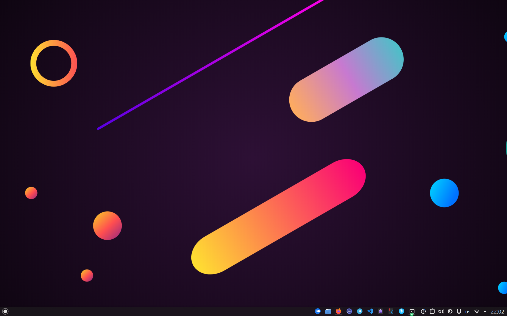

## Overview

## NixOS distribution page

- https://nixos.org/download/#nix-more

## Plasma config

- Global theme: ChromeOS-dark
- Font family: default
- Colors: Kanagawa Dragon
- Icons: Tela dark (reserved: Fluent dark icon theme)
- Cursor: Vimix Cursors

## NixOS config

1. Ssh server
2. Gnupg agent
3. Kubernetes (single node)
4. Firewall for home dev
5. Partition manager
6. Bluetooth
7. Nvidia driver
8. Docker (TODO)

### Home manager

1. Kmail
2. Git with autoconfig
3. Obisidian with electron fix
4. Fonts, command line utilities, graphical applications

## Author

- alexmalder

